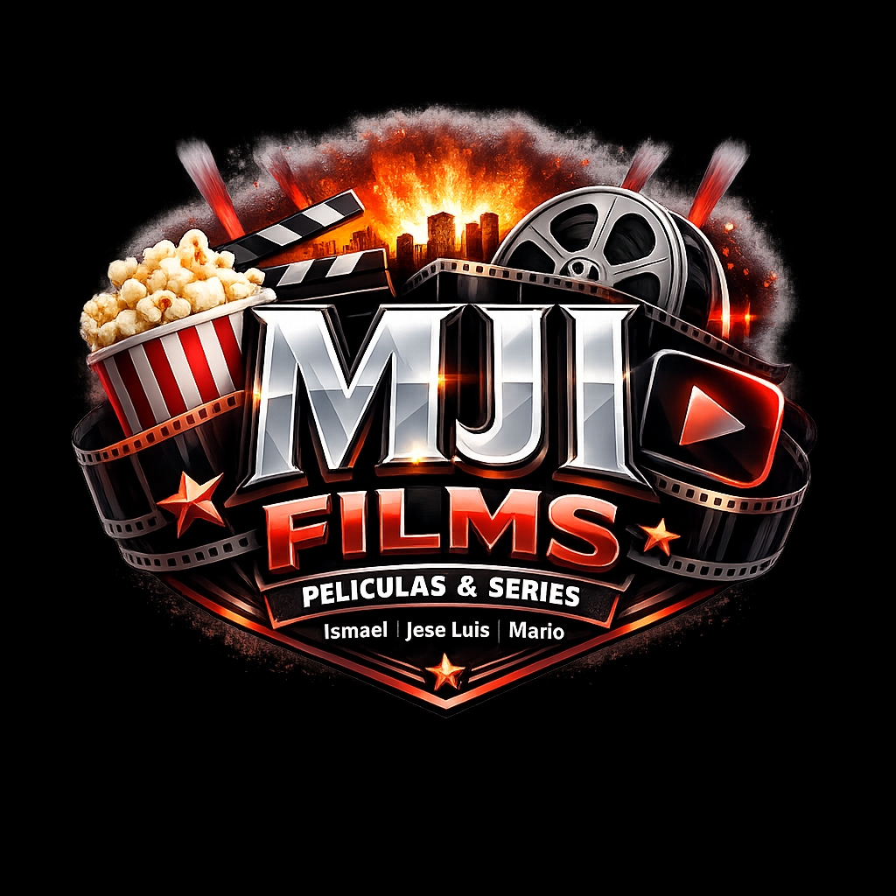

# 🎬 MJI FILMS - Proyecto Final React 2º DAW

<p align="center">
  
</p>

**Equipo de Desarrollo:**
*   **Ismael** | **Jose Luis** | **Mario**

## 📋 Objetivos
El objetivo principal de este proyecto es desarrollar una **Aplicación de Página Única (SPA)** moderna y funcional utilizando el ecosistema de **React** y **TypeScript**. **MJI Films** permite a los usuarios explorar, buscar y descubrir recomendaciones personalizadas sobre películas y series de televisión utilizando la API de **TMDB**.

Este proyecto demuestra el dominio de:
*   Arquitectura de componentes (**Atomic Design**).
*   Enrutamiento avanzado con **React Router v6**.
*   Manejo de estado global y contextos (**Context API**).
*   Internacionalización (**i18n**) nativa (ES/EN).
*   Persistencia de preferencias (Tema y Idioma).
*   Integración de APIs externas con **Axios**.
*   Estilizado premium con **Tailwind CSS**.

## ✨ Características Principales
1.  **Exploración de Tendencias (Home XL):** Portada dinámica expandida con secciones de Tendencias, Series Populares, Próximos Estrenos y Mejor Valoradas.
2.  **Recomendador Dinámico (Quiz):** Algoritmo inteligente que recomienda películas/series basadas en las respuestas del usuario a un test rápido.
3.  **Búsqueda Interactiva:** Página de búsqueda rediseñada con buscador integrado y recomendaciones de tendencias automáticas cuando no hay una búsqueda activa.
4.  **Multilenguaje Real:** Soporte completo para **Español** e **Inglés**, incluyendo metadatos de la API sincronizados.
5.  **Modo Oscuro/Claro Cinematic:** Interfaz de alto impacto visual con paleta "Hollywood" (Rojo/Oro/Carbono) y footer negro persistente.
6.  **Trailers Integrados:** Reproducción nativa de trailers de YouTube directamente en la app.
7.  **Catálogo Infinito:** Página de películas con sistema de paginación ("Cargar más"), filtros por género y ordenación avanzada.

## 🛠️ Tecnologías Utilizadas
*   **Core:** React 18, TypeScript, Vite.
*   **Gestión de Estado:** Context API (Theme & Language).
*   **Enrutamiento:** React Router DOM v6.
*   **Peticiones HTTP:** Axios + Fallback a Mock Data.
*   **Estilos:** Tailwind CSS 3.x, Animate.css (opcional).
*   **Branding:** Logo original diseñado por el equipo.

## 🚀 Instrucciones de Instalación

1.  **Clonar el repositorio:**
    ```bash
    git clone https://github.com/ismaelfrdaw/ProyFinalDWEC.git
    cd proyfinaldwec
    ```

2.  **Instalar dependencias:**
    ```bash
    npm install
    ```

3.  **Configurar Variables de Entorno:**
    *   Crea un archivo `.env` en la raíz (basado en `.env.example`).
    *   Añade tu API Key de TMDB:
        ```
        VITE_TMDB_API_KEY=tu_api_key_aqui
        ```

4.  **Ejecutar en modo desarrollo:**
    ```bash
    npm run dev
    ```

## 📖 Guía de Uso

*   **Quiz:** Prueba el botón "Recomendador" en la cabecera para encontrar tu próxima película favorita según tu estado de ánimo.
*   **Traducciones:** Cambia entre "ES" y "EN" al instante con el toggle situado junto al tema.
*   **Detalles:** Pulsa en cualquier tarjeta para ver el trailer, sinopsis y detalles técnicos.

## 📁 Estructura del Proyecto
```
src/
├── assets/           # Branding y recursos estáticos (Logo)
├── components/       # UI siguiendo Atomic Design (Atoms, Molecules, Organisms)
├── context/          # Proveedores de Tema e Idioma
├── i18n/             # Diccionarios de traducción (ES/EN)
├── layout/           # Estructura base MainLayout
├── pages/            # Vistas (Home, Search, Details, Movies, Quiz)
├── services/         # Cliente API (Axios) y Mock Data Service
└── types/            # Tipado estricto TS
```

---
Desarrollado con ❤️ por **Ismael, Jose Luis y Mario**. © 2026 MJI Films.
